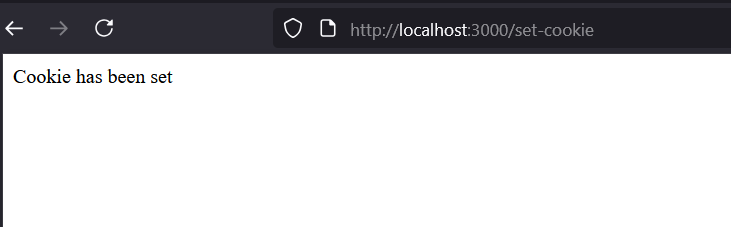

# awt_01
# 💻 Web Technology Lab – Experiments Summary

This repository contains all experiments and classwork done as part of the *Advanced Web Technology (AWT)* lab.  
Each experiment focuses on different web technologies including HTML, CSS, JavaScript, jQuery, AngularJS, and Node.js.

---

## 📑 Table of Contents
1. [Experiment 1](#-experiment-1)
2. [Experiment 2](#-experiment-2)
3. [Experiment 3](#-experiment-3)
4. [Experiment 4](#-experiment-4)
5. [Experiment 5](#-experiment-5)
6. [Experiment 5_6](#-experiment-5_6)
7. [Experiment 7](#-experiment-7)
8. [Conclusion](#-conclusion)

---

## 🧪 Experiment 1
*Topic:* Basic HTML, CSS, and JavaScript Integration  
*Files:* index.html, d1.js, s.css

*What I learned:*
- Creating basic web pages using HTML.
- Linking CSS and JS files to an HTML document.
- Handling basic DOM manipulation using JavaScript.

**Code**

#### 🗂 index.html
```html
<!DOCTYPE html>
<html lang="en">
<head>
    <meta charset="UTF-8">
    <meta name="viewport" content="width=device-width, initial-scale=1.0">
    <title>LAB EXP 1</title>
    <script src="https://ajax.googleapis.com/ajax/libs/jquery/3.7.1/jquery.min.js"></script>
    <link rel="stylesheet" href="s.css">
</head>
<body>

    <div class="container">
        <h1>1. Right-Click Disabled</h1>
        <p>Try right-clicking anywhere on this page. The context menu will not appear.</p>
    </div>

    <hr>

    <div class="container">
        <h1>2. Show/Hide Message</h1>
        <button id="showBtn">Show Message</button>
        <button id="hideBtn">Hide Message</button>
        <div id="messageDiv">
            <p>Hello! This message can be hidden and shown using the buttons above.</p>
        </div>
    </div>

    <hr>

    <div class="container">
        <h1>3. Paragraph Color Change on Hover</h1>
        <p class="hover-para">This paragraph changes color.</p>
    </div>

    <hr>

    <div class="container" style="height: 1200px;">
        <h1>4. Scroll to Top</h1>
        <p>Scroll down this page to see the image in the bottom-right corner. Clicking it will bring you back to the top of the page.</p>
    </div>

    
    

    <script src="d1.js"></script>

</body>
</html>
```

#### 🗂 s.css
```CSS
body {
            font-family: Arial, sans-serif;
            margin: 20px;
            padding-bottom: 1500px; 
        }
        .container {
            margin-bottom: 40px;
        }
        h1 {
            color: orchid;
        }
        p {
            font-size: 1.1em;
            cursor: pointer;
            transition: color 0.3s ease;
        }
        #messageDiv {
            padding: 20px;
            border: 1px solid yellowgreen;
            background-color:white;
            margin-top: 10px;
            border-radius: 8px;
            display: none; 
        }
        button {
            padding: 10px 15px;
            margin-right: 10px;
            cursor: pointer;
            border: none;
            border-radius: 5px;
            background-color: pink ;
            color: white;
        }
        button:hover {
            background-color: red;
        }
        #scrollToTopBtn {
            position: fixed;
            bottom: 20px;
            right: 20px;
            width: 50px;
            height: 50px;
            cursor: pointer;
            border: 2px solid beige;
            border-radius: 50%;
            background-color: powderblue;
            box-shadow: 0 4px 6px black;
        }
```
#### 🗂 d1.js
```JS

$(document).on("selectstart", function(e){ 
    e.preventDefault();
});

$(document).on("keydown", function(e) {
    if (e.ctrlKey && e.keyCode === 67) e.preventDefault();
});

 $(document).ready(function() {
            // 1. Disable the right-click menu
            $(document).on("contextmenu", function(e) {
                e.preventDefault();
            });

            // 2. Display and hide a message
            $("#showBtn").click(function() {
                $("#messageDiv").show('slow');
            });
            $("#hideBtn").click(function() {
                $("#messageDiv").hide('slow');
            });

            // 3. Change paragraph color on mouseover
            $(".hover-para").mouseover(function() {
                $(this).css("color", "red");
            });
            $(".hover-para").mouseout(function() {
                $(this).css("color", "#333");
            });

            // 4. Click an image to scroll to the top
            $("#scrollToTopBtn").click(function() {
                $("html, body").animate({ scrollTop: 0 }, 'slow');
            })

        });
```
### output
  

*Challenges faced:*
- Understanding how external JS and CSS files are connected.
- Debugging syntax errors in JavaScript.

---

## 🧪 Experiment 2
*Topic:* Advanced JavaScript – Events and DOM  
*Files:* index.html, d2.js, s.css

*What I learned:*
- Implementing DOM manipulation using JavaScript.
- Handling user events like click, hover, etc.
- Understanding internal vs external JS files.

**Code**

#### 🗂 index.html
```html
<!DOCTYPE html>
<html lang="en">
<head>
  <meta charset="UTF-8">
  <meta name="viewport" content="width=device-width, initial-scale=1.0">
  <title>Lab exp 2</title>
  <link rel="stylesheet" href="s.css">
  <script src="https://code.jquery.com/jquery-3.6.0.min.js"></script>
</head>
<body>
  <div class="container">
    <h1>Add a class to an element</h1>
    <button id="addbtn">Add border</button>
    <p id="adclass">Click the button to add a border to me</p>
  </div>

  <hr>

  <div class="container">
    <h1>Access element's position</h1>
    <button id="getposition">Get position</button>
    <div id="result"></div>
    <div id="pele">This is the positioned element</div>
  </div>

  <hr>

  <div class="container">
    <h1>Animate multiple CSS properties</h1>
    <button id="animatebtn">Animate box</button>
    <div id="animatedBox"></div>
  </div>

  <script src="d2.js"></script>
</body>
</html>
```

#### 🗂 s.css
```CSS
body {
  font-family: Arial, sans-serif;
  margin: 20px;
  padding-bottom: 1500px;
}
.container {
  margin-bottom: 40px;
}
h1 {
  color: #333;
}
.highlighted {
  border: 5px solid #ff0000;
  box-shadow: 0 0 10px rgba(255, 0, 0, 0.5);
}
#animatedBox {
  width: 100px;
  height: 100px;
  background-color: #ff9800;
  position: relative;
}
button {
  padding: 10px 15px;
  margin-right: 10px;
  cursor: pointer;
  border: none;
  border-radius: 5px;
  background-color: blue;
  color: white;
}
```
#### 🗂 d2.js
```JS

 $(document).ready(function(){
      $("#addbtn").click(function(){
        $("#adclass").addClass("highlighted");
      });

      $("#getposition").click(function(){
        var position = $("#pele").position();
        var res = "Top: " + position.top + "px, Left: " + position.left + "px";
        $("#result").text(res);
      });

      $("#animatebtn").click(function(){
        $("#animatedBox").animate({
          width: '200px',
          height: '200px',
          opacity: 0.5,
          marginLeft: '50px'
        }, 1000, function() {
          $(this).animate({
            width: '100px',
            height: '100px',
            opacity: 1,
            marginLeft: '0px'
          }, 1000);
        });
      });
    });
```
### output
  

*Challenges faced:*
- Managing multiple event listeners.
- Debugging issues caused by incorrect DOM element references.

---

## 🧪 Experiment 3
*Topic:* Introduction to Node.js  
*Files:* index.html, app.js


*What I learned:*
- Setting up a Node.js environment.
- Creating a simple web server using Node.js.
- Sending responses to client requests.

**Code**

#### 🗂 index.html
```html
<!doctype html>
<html ng-app="tableApp">
<head>
  <meta charset="utf-8">
  <title>Experiment 3 - AngularJS Tables</title>
  <script src="https://ajax.googleapis.com/ajax/libs/angularjs/1.8.3/angular.min.js"></script>
  <script src="app.js"></script>
  <style>
    table { border-collapse: collapse; width: 100%; }
    th, td { border: 1px solid #ccc; padding: 8px; }
    tr.even { background: #f8f8f8; }
    tr.odd { background: #ffffff; }
    th { background: #eee; }
  </style>
</head>
<body ng-controller="TableController as ctrl">
  <div class="container">
    <h1>AngularJS Table Examples</h1>

    <section>
      <h2>1. Display a Table</h2>
      <table>
        <thead>
          <tr>
            <th>#</th>
            <th>Name</th>
            <th>Age</th>
            <th>Department</th>
          </tr>
        </thead>
        <tbody>
          <tr ng-repeat="student in ctrl.students track by $index" ng-class-odd="'odd'" ng-class-even="'even'">
            <td>{{$index + 1}}</td>
            <td>{{student.name}}</td>
            <td>{{student.age}}</td>
            <td>{{student.dept}}</td>
          </tr>
        </tbody>
      </table>
    </section>

    <section>
      <h2>2. Display contents with orderBy filter</h2>
      <label>Sort by:
        <select ng-model="ctrl.sortKey">
          <option value="name">Name</option>
          <option value="age">Age</option>
          <option value="dept">Department</option>
        </select>
        <label><input type="checkbox" ng-model="ctrl.reverse"> Reverse</label>
      </label>

      <table>
        <thead>
          <tr>
            <th>#</th>
            <th>Name</th>
            <th>Age</th>
            <th>Department</th>
          </tr>
        </thead>
        <tbody>
          <tr ng-repeat="student in ctrl.students | orderBy:ctrl.sortKey:ctrl.reverse track by $index" ng-class-even="'even'" ng-class-odd="'odd'">
            <td>{{$index + 1}}</td>
            <td>{{student.name}}</td>
            <td>{{student.age}}</td>
            <td>{{student.dept}}</td>
          </tr>
        </tbody>
      </table>
    </section>

    <section>
      <h2>3. Display Table with even and odd rows (styling already shown)</h2>
      <p>Notice rows have alternating backgrounds using <code>ng-class-even</code> and <code>ng-class-odd</code>.</p>
    </section>
  </div>
</body>
</html>

```
#### 🗂 app.js
```JS

angular.module('tableApp', [])
  .controller('TableController', function() {
    const vm = this;

    vm.students = [
      { name: 'Asha', age: 22, dept: 'CSE' },
      { name: 'Bikram', age: 24, dept: 'ECE' },
      { name: 'Charu', age: 21, dept: 'ME' },
      { name: 'Deep', age: 23, dept: 'CSE' },
      { name: 'Esha', age: 20, dept: 'EE' }
    ];

    vm.sortKey = 'name';
    vm.reverse = false;
  });

```
### output
  

*Challenges faced:*
- Installing Node.js packages using npm.
- Understanding asynchronous execution in Node.js.

---

## 🧪 Experiment 4
*Topic:* HTML Forms and Data Handling  
*Files:* bill.html, form.html

*What I learned:*
- Creating HTML forms and input fields.
- Using form attributes like action, method, and name.
- Validating form inputs.

**Code**

#### 🗂 bill.html
```html
<!DOCTYPE html>
<html lang="en" ng-app="billApp">
<head>
  <meta charset="UTF-8">
  <title>Bill Payment Record</title>
  <script src="https://ajax.googleapis.com/ajax/libs/angularjs/1.8.3/angular.min.js"></script>
  <style>
    body { font-family: Arial, sans-serif; margin: 20px; }
    table { border-collapse: collapse; width: 100%; margin-top: 20px; }
    th, td { border: 1px solid #ccc; padding: 8px; text-align: left; }
    th { background: #eee; }
    input, button { margin: 5px; padding: 6px; }
  </style>
</head>
<body ng-controller="BillController">

  <h2>Bill Payment Record</h2>

  <!-- Form to add new records -->
  <form name="billForm" ng-submit="addRecord(billForm)" novalidate>
    <label>
      Name:
      <input type="text" name="name" ng-model="newRecord.name" required>
    </label>
    <label>
      Amount:
      <input type="number" name="amount" ng-model="newRecord.amount" required min="0">
    </label>
    <label>
      Date:
      <input type="date" name="date" ng-model="newRecord.date" required>
    </label>
    <button type="submit" ng-disabled="billForm.$invalid">Add</button>
  </form>

  <!-- Records table -->
  <table ng-if="records.length > 0">
    <thead>
      <tr>
        <th>#</th>
        <th>Name</th>
        <th>Amount</th>
        <th>Date</th>
      </tr>
    </thead>
    <tbody>
      <tr ng-repeat="record in records track by record.id">
        <td>{{$index + 1}}</td>
        <td>{{record.name}}</td>
        <td>{{record.amount | currency}}</td>
        <td>{{record.date | date:'mediumDate'}}</td>
      </tr>
    </tbody>
  </table>

  <script>
    angular.module('billApp', [])
      .controller('BillController', function($scope) {
        // Initial records
        $scope.records = [
          { id: 1, name: 'Electricity', amount: 1200, date: '2025-07-01' },
          { id: 2, name: 'Internet', amount: 799, date: '2025-07-05' }
        ];

        $scope.newRecord = {};

        // Add new record
        $scope.addRecord = function(form) {
          if (form.$valid) {
            let newId = $scope.records.length + 1;
            $scope.records.push({
              id: newId,
              name: $scope.newRecord.name,
              amount: $scope.newRecord.amount,
              date: $scope.newRecord.date
            });
            $scope.newRecord = {};
            form.$setPristine();
            form.$setUntouched();
          }
        };
      });
  </script>
</body>
</html>

```
#### 🗂 form.html
```html
<!DOCTYPE html>
<html lang="en" ng-app="formApp">
<head>
  <meta charset="UTF-8">
  <title>AngularJS Registration Form</title>
  <script src="https://ajax.googleapis.com/ajax/libs/angularjs/1.8.3/angular.min.js"></script>

  <style>
    .error { color: red; font-size: 14px; }
    input.ng-invalid.ng-touched { border: 2px solid red; }
    input.ng-valid.ng-touched { border: 2px solid green; }
    .success { color: green; margin-top: 10px; }
  </style>

</head>

<body ng-controller="FormController">

  <h2>User Registration</h2>
  <form name="regForm" novalidate ng-submit="register(regForm)">
    <label>Name:
      <input type="text" name="name" ng-model="user.name" required ng-minlength="3">
    </label>
    <div class="error" 
         ng-show="(regForm.name.$touched || submitted) && regForm.name.$invalid">
      Name must be at least 3 characters.
    </div>
    <br><br>

    <label>Email:
      <input type="email" name="email" ng-model="user.email" required>
    </label>
    <div class="error" 
         ng-show="(regForm.email.$touched || submitted) && regForm.email.$invalid">
      Enter a valid email.
    </div>
    <br><br>

    <label>Password:
      <input type="password" name="password" ng-model="user.password" required ng-minlength="6">
    </label>
    <div class="error" 
         ng-show="(regForm.password.$touched || submitted) && regForm.password.$invalid">
      Password must be at least 6 characters.
    </div>
    <br><br>

    <button type="submit">Register</button>
  </form>

  <p class="success" ng-if="success">{{success}}</p>

  <script>
    angular.module('formApp', [])
      .controller('FormController', function($scope) {
        $scope.user = {};
        $scope.submitted = false;
        $scope.success = '';

        $scope.register = function(form) {
          if (form.$valid) {
            // In real app, send data to server
            $scope.success = 'Registration successful for ' + $scope.user.name;
            $scope.user = {};
            form.$setPristine();  // Reset form state
            form.$setUntouched(); // Reset touched state
            $scope.submitted = false;
          } else {
            $scope.success = '';
            $scope.submitted = true; // Show validation messages
          }
        };
      });
  </script>
</body>
</html>
```

### output-bill

### output-form
    


*Challenges faced:*
- Handling form validation using JavaScript.
- Designing a clean and structured form layout.

---


### 🧪 Experiment 5_6
*Topic:* Express.js and Modular Node.js Applications  
*Files:*  server.js, package.json

*What I learned:*
- Installing and using Express.js framework.
- Creating routes and handling requests in Express.
- Understanding package.json and dependencies.

**Code**

#### 🗂 server.js 
```JS
const express = require('express');
const app = express();
const PORT = process.env.PORT || 3000; 

// Hello World endpoint
app.get('/', (req, res) => {
  res.send('Hello, World!');
});

// String replacement endpoint
app.get('/replace', (req, res) => {
  const { text } = req.query;
  if (!text) {
    return res.status(400).json({ error: 'Text parameter is required' });
  }
  
  const regex = /a{2,}/g;
  const result = text.replace(regex, 'b');
  res.json({ original: text, replaced: result });
});

// Calculator endpoint
app.get('/calculate', (req, res) => {
  const { operation, num1, num2 } = req.query;
  const n1 = parseFloat(num1);
  const n2 = parseFloat(num2);
  
  if (isNaN(n1) || isNaN(n2)) {
    return res.status(400).json({ error: 'Invalid numbers provided' });
  }
  
  let result;
  switch(operation) {
    case 'add':
      result = n1 + n2;
      break;
    case 'subtract':
      result = n1 - n2;
      break;
    case 'multiply':
      result = n1 * n2;
      break;
    case 'divide':
      result = n2 !== 0 ? n1 / n2 : 'Error: Division by zero';
      break;
    default:
      return res.status(400).json({ error: 'Invalid operation. Use add, subtract, multiply, or divide' });
  }
  
  res.json({ operation, num1: n1, num2: n2, result });
});

// Array iteration endpoint
app.get('/iterate', (req, res) => {
  const array = [10, 20, 30, 40, 50];
  const iterations = [];
  
  // Using for loop
  iterations.push("Using for loop:");
  for (let i = 0; i < array.length; i++) {
    iterations.push(`Index ${i}: ${array[i]}`);
  }
  
  // Using forEach
  iterations.push("Using forEach:");
  array.forEach((item, index) => {
    iterations.push(`Index ${index}: ${item}`);
  });
  
  // Using for...of
  iterations.push("Using for...of:");
  for (const item of array) {
    iterations.push(`Item: ${item}`);
  }
  
  res.json({ array, iterations });
});

app.listen(PORT, () => {
  console.log(`Server running at http://localhost:${PORT}`);
  console.log('Available endpoints:');
  console.log('  GET / - Hello World');
  console.log('  GET /replace?text=your_text - Replace multiple a\'s with b');
  console.log('  GET /calculate?operation=add&num1=5&num2=3 - Calculator');
  console.log('  GET /iterate - Array iteration examples');
});
```
#### 🗂 package.json 
```JSON
{
  "name": "nodeja-lab",
  "version": "1.0.0",
  "description": "\"NodeJS basic exercies lab\",",
  "main": "index.js",
  "dependencies": {
    "accepts": "^2.0.0",
    "body-parser": "^2.2.0",
    "bytes": "^3.1.2",
    "call-bind-apply-helpers": "^1.0.2",
    "call-bound": "^1.0.4",
    "content-disposition": "^1.0.0",
    "content-type": "^1.0.5",
    "cookie": "^0.7.2",
    "cookie-signature": "^1.2.2",
    "debug": "^4.4.3",
    "depd": "^2.0.0",
    "dunder-proto": "^1.0.1",
    "ee-first": "^1.1.1",
    "encodeurl": "^2.0.0",
    "es-define-property": "^1.0.1",
    "es-errors": "^1.3.0",
    "es-object-atoms": "^1.1.1",
    "escape-html": "^1.0.3",
    "etag": "^1.8.1",
    "express": "^5.1.0",
    "finalhandler": "^2.1.0",
    "forwarded": "^0.2.0",
    "fresh": "^2.0.0",
    "function-bind": "^1.1.2",
    "get-intrinsic": "^1.3.0",
    "get-proto": "^1.0.1",
    "gopd": "^1.2.0",
    "has-symbols": "^1.1.0",
    "hasown": "^2.0.2",
    "http-errors": "^2.0.0",
    "iconv-lite": "^0.6.3",
    "inherits": "^2.0.4",
    "ipaddr.js": "^1.9.1",
    "is-promise": "^4.0.0",
    "math-intrinsics": "^1.1.0",
    "media-typer": "^1.1.0",
    "merge-descriptors": "^2.0.0",
    "mime-db": "^1.54.0",
    "mime-types": "^3.0.1",
    "ms": "^2.1.3",
    "negotiator": "^1.0.0",
    "object-inspect": "^1.13.4",
    "on-finished": "^2.4.1",
    "once": "^1.4.0",
    "parseurl": "^1.3.3",
    "path-to-regexp": "^8.3.0",
    "proxy-addr": "^2.0.7",
    "qs": "^6.14.0",
    "range-parser": "^1.2.1",
    "raw-body": "^3.0.1",
    "router": "^2.2.0",
    "safe-buffer": "^5.2.1",
    "safer-buffer": "^2.1.2",
    "send": "^1.2.0",
    "serve-static": "^2.2.0",
    "setprototypeof": "^1.2.0",
    "side-channel": "^1.1.0",
    "side-channel-list": "^1.0.0",
    "side-channel-map": "^1.0.1",
    "side-channel-weakmap": "^1.0.2",
    "statuses": "^2.0.2",
    "toidentifier": "^1.0.1",
    "type-is": "^2.0.1",
    "unpipe": "^1.0.0",
    "vary": "^1.1.2",
    "wrappy": "^1.0.2"
  },
  "devDependencies": {},
  "scripts": {
    "test": "node server.js",
    "start": "node lab/Experiment_5_6/server.js"
  },
  "repository": {
    "type": "git",
    "url": "awt_01"
  },
  "keywords": [
    "[\"nodejs\"",
    "\"express\"",
    "\"lab\"]"
  ],
  "author": "sonal",
  "license": "ISC"
}
```

### output

### output

### output

### output

 

*Challenges faced:*
- Configuring Express properly.
- Managing multiple JavaScript files in one project.

---

## 🧪 Experiment 7
*Topic:* Node.js Sessions and Cookies  
*Files:* source/, server.js, package.json

*What I learned:*
- Using cookies and sessions in Node.js.
- Maintaining user sessions across multiple pages.
- Understanding middleware and session storage.

**Code**

#### 🗂 cookie-example.js
```JS

const express = require('express');
const cookieParser = require('cookie-parser');

const app = express();
app.use(cookieParser());

app.get('/set-cookie', (req, res) => {
    res.cookie('username', 'JohnDoe', { maxAge: 900000 });
    res.send('Cookie has been set');
});

app.get('/get-cookie', (req, res) => {
    const user = req.cookies['username'];
    res.send(`Cookie Retrieved: ${user}`);
});

app.get('/delete-cookie', (req, res) => {
    res.clearCookie('username');
    res.send('Cookie deleted');
});

const PORT = process.env.PORT || 3000;

app.listen(PORT, () => {
    console.log(`Server started on http://localhost:${PORT}`);
});

```

#### 🗂 session-example.js
```JS
const express = require('express');
const session = require('express-session');

const app = express();

app.use(session({
    secret: 'mysecretkey',
    resave: false,
    saveUninitialized: true
}));

app.get('/', (req, res) => {
    if (req.session.views) {
        req.session.views++;
        res.send(`Welcome back! You visited ${req.session.views} times.`);
    } else {
        req.session.views = 1;
        res.send('Welcome to the session demo. Refresh to count visits.');
    }
});

app.get('/destroy', (req, res) => {
    req.session.destroy(err => {
        if (err) {
            return res.send('Error destroying session');
        }
        res.send('Session destroyed');
    });
});

const PORT = process.env.PORT || 3000;

app.listen(PORT, () => {
    console.log(`Server started on http://localhost:${PORT}`);
});
```
### 🗂 package.json
```JSON
{
  "name": "experiment_7",
  "version": "1.0.0",
  "description": "",
  "main": "index.js",
  "scripts": {
    "test": "echo \"Error: no test specified\" && exit 1"
  },
  "keywords": [],
  "author": "",
  "license": "ISC",
  "dependencies": {
    "cookie-parser": "^1.4.7",
    "express": "^5.1.0",
    "express-session": "^1.18.2"
  }
}
```
### output-cookie.js
 
### output-cookie.js
  
### output-cookie.js
  
### output-session.js
  
### output-session.js
  

*Challenges faced:*
- Configuring session middleware correctly.
- Debugging cookie handling issues.

---

## 🏁 Conclusion
This lab helped me gain hands-on experience in *front-end and back-end web development*.  
I learned how to:
- Design interactive front-end applications (HTML, CSS, JS, jQuery, Angular).
- Build and deploy backend applications using *Node.js and Express*.
- Handle user sessions, cookies, and server routing.

*Overall Challenge:*  
Initially, understanding how client and server communicate was difficult, but through these experiments, I developed a clear understanding of *full-stack web development*.

---

*Submitted by:* Sonal  
*Course:* Advanced Web Technology Lab  
*Tools Used:* VS Code, Node.js, GitHub